# Visão Geral: nfse-php

O `nfse-php` é uma biblioteca agnóstica de framework que fornece os blocos de construção para interagir com a NFS-e Nacional.

## Responsabilidades

1.  **Modelagem de Dados**: Define as classes que representam o domínio (Nota Fiscal, DPS, Pessoas) através de DTOs robustos. Veja a seção **[Tipos (DTOs)](./types/main-documents)**.
2.  **Validação**: Garante que os dados estejam em conformidade com as regras de negócio básicas e o schema nacional antes do envio.
3.  **Comunicação (SDK)**: Cliente HTTP nativo para integração com os Web Services da SEFIN Nacional e ADN.
4.  **Geração de Tipos**: Facilita a integração com o frontend através da geração automática de tipos TypeScript.

## Tecnologia de DTOs

Utilizamos a biblioteca `spatie/laravel-data` para definição de DTOs. Isso nos permite mapear os nomes complexos do layout nacional (ex: `endNac.cMun`) para propriedades PHP legíveis e tipadas.

### Exemplo de DTO

```php
namespace Nfse\Dto\Nfse\Nfse;

use Spatie\LaravelData\Attributes\MapInputName;
use Spatie\LaravelData\Data;

class EnderecoData extends Data
{
    public function __construct(
        #[MapInputName('endNac.cMun')]
        public ?string $codigoMunicipio,

        #[MapInputName('endNac.CEP')]
        public ?string $cep,

        #[MapInputName('xLgr')]
        public ?string $logradouro,
        // ...
    ) {}
}
```

## Por que DTOs?

A integração com sistemas fiscais como a NFS-e Nacional envolve centenas de campos com nomes técnicos e regras de validação estritas. O uso de DTOs (Data Transfer Objects) traz diversos benefícios:

-   **Segurança de Tipos**: Evita erros comuns ao lidar com arrays associativos.
-   **Auto-completar**: Facilita a descoberta de campos disponíveis na sua IDE.
-   **Validação Antecipada**: Detecta erros de dados antes mesmo de tentar gerar o XML ou enviar para o governo.
-   **Mapeamento Amigável**: Traduz nomes técnicos do XML (ex: `dhEmi`) para nomes legíveis (ex: `dataEmissao`).

## Fluxo de Trabalho

O fluxo típico de uso da biblioteca segue estes passos:

1.  **Entrada de Dados**: Receba dados de um formulário, API ou banco de dados.
2.  **Instanciação**: Crie um DTO usando `from()` ou `validateAndCreate()`.
3.  **Validação**: A biblioteca valida automaticamente os tipos e restrições básicas.
4.  **Assinatura**: Assine o XML gerado usando seu certificado digital.
5.  **Transmissão**: Utilize o `NfseClient` para enviar o documento para o governo.

```mermaid
graph LR
    A[Dados Brutos] --> B[DTO Data]
    B --> C{Validação}
    C -- OK --> D[XML Builder]
    D --> E[Xml Signer]
    E --> F[Nfse Client]
    F --> G[Sefin Nacional]
    C -- Erro --> H[Exceção de Validação]
```



## Instalação

```bash
composer require nfse-nacional/nfse-php
```

## Uso Básico

A biblioteca permite criar e validar documentos de forma simples:

```php
use Nfse\Dto\Nfse\DpsData;

// Criando a partir de um array de dados
$dps = DpsData::from([
    'infDps' => [
        'tpAmb' => 2,
        'dhEmi' => '2023-10-27T10:00:00',
        // ...
    ]
]);

// Validando os dados
DpsData::validate($dps->toArray());
```

---

## 📚 Próximos Passos

-   **[DTOs e Validações](./dtos)** - Aprenda as 3 formas de construir DTOs
-   **[Serialização XML](./xml-serialization)** - Como gerar XMLs válidos
-   **[Assinatura Digital](./digital-signature)** - Assine seus documentos
-   **[Utilitários](./utilities/id-generator)** - Helpers úteis para o dia a dia
-   **[Exemplos Práticos](./full-example)** - Exemplos completos de uso

---

## 🔗 Referências

-   **[Spatie Laravel Data](https://spatie.be/docs/laravel-data)** - Biblioteca base dos DTOs
-   **[Manual NFSe Nacional](https://www.gov.br/nfse/)** - Documentação oficial do governo
-   **[Schemas XSD](https://github.com/nfse-nacional/nfse-php/tree/main/references/schemas)** - Schemas oficiais da NFSe
-   **[GitHub do Projeto](https://github.com/nfse-nacional/nfse-php)** - Código-fonte e issues
-   **[Packagist](https://packagist.org/packages/nfse-nacional/nfse-php)** - Pacote Composer
